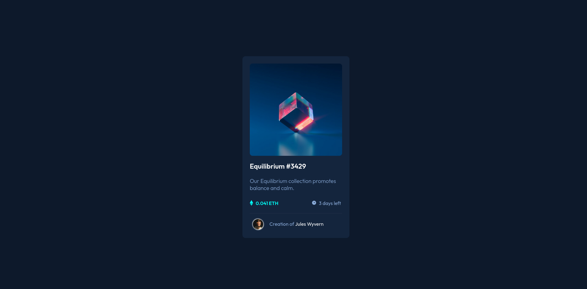

# Frontend Mentor - NFT Preview Card Component

## Overview

### The challenge

Users should be able to:

- View the optimal layout depending on their device's screen size
- See hover states for interactive elements

### Screenshot

### What I learned
- Hover states for links.
- Overlaying div on top of image with transition (using display, position, transition, top/bottom/left/right)
- Adding SVG as an inline object, getting it to align.
- Using filter/drop-shadow to create a border around a circular transparent image (see link below)
- Creating a divider using 'hr' and then setting border-top/opacity.

### What I need to work on
- Aligning things more efficiently.
- Sizing SVG / using SVGs in general (sizing - width/height?).

### Useful resources

- [CSS Border on transparent PNG](https://www.edureka.co/community/181780/css-border-on-png-image-with-transparent-parts) - Using filter/drop-shadow to create a border around a circular transparent image
