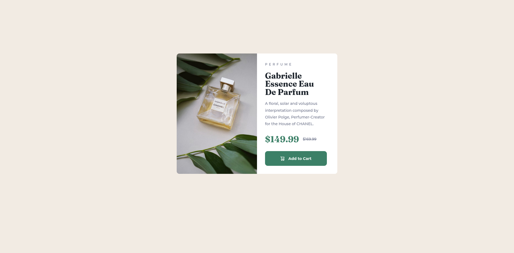

# Frontend Mentor - Stats Preview Card Component

## Overview

### The challenge

Users should be able to:

- View the optimal layout depending on their device's screen size
- See hover and focus states for interactive elements

### Screenshot



### What I learned
- Creating and styling button (border, padding, etc).
- Hover state of button and svg icon
- Creating mobile layout for the first time 
- Filling div with image with correct ratio (using object-fit: cover)

```css
@media(max-width: 600px) {}
```

