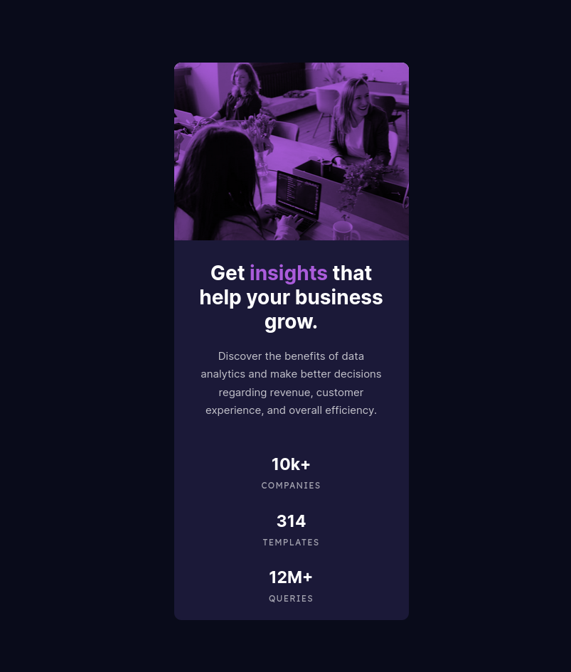
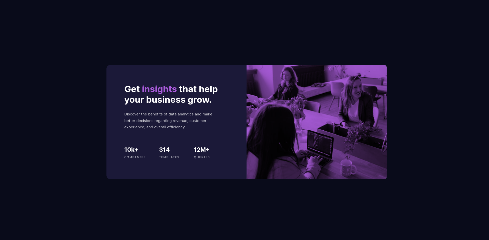

# Frontend Mentor - Stats Preview Card Component

## Overview

### The challenge

Users should be able to:

- View the optimal layout depending on their device's screen size

### Screenshot

### What I learned

- Line height to 'stretch' out text
- Using background-image/color/blend-mode to create image with color overlay.

### Useful resources

- [CSS Blend Modes](https://css-tricks.com/basics-css-blend-modes/) - Helped me figure out how to lay color over a photo. Might be fun to experiment in the future.
